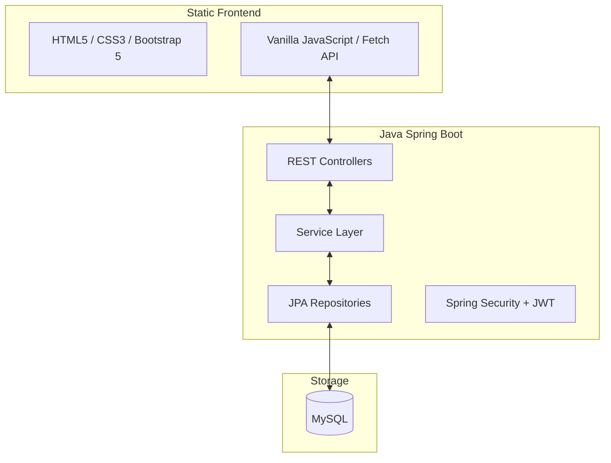

# 🏠 Hostel Management System

A unified, full-stack Hostel Management System built with **Java Spring Boot**, **Hibernate (JPA)**, and a modern **HTML/CSS/JS** frontend.

---

## 🚀 Live Demo

👉 Click here to open the project:  
https://hostel-management-production-f2e2.up.railway.app/

---

## 🏗️ Project Architecture



---

## 📂 Project Structure

```text
Hostel-Management-master/
├── src/
│   ├── main/
│   │   ├── java/com/hostel/management/
│   │   │   ├── config/             # Security, Data Initializer
│   │   │   ├── controller/         # REST API Endpoints
│   │   │   ├── dto/                # Data Transfer Objects (Requests/Responses)
│   │   │   ├── entity/             # Hibernate Entities (Database Models)
│   │   │   ├── exception/          # Global Error Handling
│   │   │   ├── repository/         # JPA Repositories
│   │   │   ├── security/           # JWT Utilities
│   │   │   ├── service/            # Business Logic
│   │   │   └── HostelManagementApplication.java  # Main Entry Point
│   │   └── resources/
│   │       ├── static/             # HTML, CSS, JS Frontend Files
│   │       │   ├── css/            # Custom Styles
│   │       │   ├── js/             # app.js (Frontend Logic)
│   │       │   └── *.html          # UI Pages
│   │       └── application.properties # Database & App Configuration
└── pom.xml                         # Maven Dependencies
```

---

## 🚀 Getting Started

### Prerequisites
- Java 17 or higher
- Maven 3.x

### 1. Database Setup
The project uses **MySQL** for data persistence.

**Before running the application:**
1. Ensure MySQL is installed and running
2. Create a database for the hostel management system
3. Update the database credentials in `src/main/resources/application.properties`:
   ```properties
   spring.datasource.url=jdbc:mysql://localhost:3306/hostel_db
   spring.datasource.username=your_mysql_user
   spring.datasource.password=your_mysql_password
   ```

### 2. Run the Application
From the project root, run:
```bash
mvn spring-boot:run
```

### 3. Access the System
- **Web UI**: [http://localhost:8080/](http://localhost:8080/)
- **API Base URL**: [http://localhost:8080/api/](http://localhost:8080/api/)

---

## 🔐 Default Admin Credentials
The system automatically seeds an administrator account on first startup:
- **Email**: `admin@example.com`
- **Password**: `passwordxxx`

---

## ✨ Key Features
- **Admin Dashboard**: Real-time stats for students and rooms.
- **Room Management**: Add, view, and delete rooms with capacity tracking.
- **Automated Allotment**: Smart student-to-room assignment logic.
- **Daily Attendance**: Track student presence with persistent history.
- **User Approval**: Security workflow for approving and linking new registrations.
- **Project Tracking**: Manage hostel-related projects and tasks.
